# SDA-Pro Comprehensive Project Report

**Project:** Security Incident Response & Threat Mitigation Platform  
**Generated:** 2026-06-02  
**Stack:** Java 21 + Spring Boot 3, React + TypeScript + Vite, PostgreSQL, Redis, RabbitMQ, Docker Compose, PlantUML

## Executive Summary

This report documents the implemented SDA-Pro university semester project. The system is demo-ready and focuses on Software Design & Architecture marks: required services, APIs, events, database schema, frontend screens, UML diagrams, ADRs, tests, all 12 design patterns, and all 4 architecture styles.

Implementation note: backend capabilities are packaged into one Spring Boot composition root for reliable local demo execution while preserving documented SOA boundaries. External cybersecurity integrations are mocked by requirement.

## Final Tech Stack

| Layer | Technology |
|---|---|
| Backend | Java 21, Spring Boot 3, Maven |
| Frontend | React, TypeScript, Vite |
| Database | PostgreSQL 16 |
| Cache | Redis 7 |
| Broker | RabbitMQ 3 |
| Realtime | Server-Sent Events |
| Docs | ADR markdown, OpenAPI, AsyncAPI, PlantUML |
| Deployment | Docker Compose |

## System Architecture

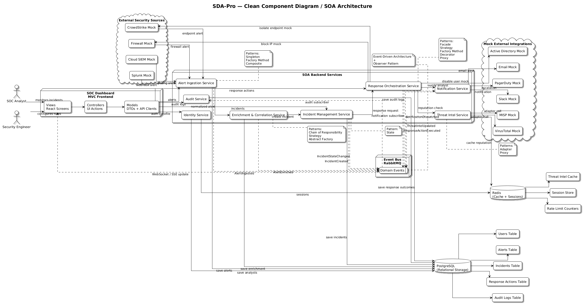

The architecture follows controller/API, application service, domain, adapter/integration, persistence, and infrastructure layers. The demo flow is:

**Component diagram explanation:** This diagram proves the SOA requirement by separating the platform into named services: ingestion, enrichment, incident management, response orchestration, threat intelligence, notification, audit, identity, dashboard, and shared contracts. It also shows PostgreSQL, Redis, RabbitMQ, and realtime dashboard communication.

1. Mock Splunk/Firewall alert enters ingestion.
2. Alert is normalized.
3. Enrichment chain processes it.
4. Threat intel adapter/proxy performs reputation lookup and caching.
5. Composite groups related alerts.
6. Correlation creates incident in New state.
7. State pattern moves incident through lifecycle.
8. Strategy selects response.
9. Factory/decorator/proxy execute action.
10. Events are published, dashboard updates, audit is stored.

## Database Schema

Required tables implemented/documented: `analysts`, `alert_sources`, `alerts`, `alert_groups`, `alert_group_members`, `enrichment_results`, `incidents`, `incident_alerts`, `incident_state_transitions`, `response_actions`, `response_action_outcomes`, `threat_indicators`, `notifications`, `audit_logs`.

## Service Boundaries

- `alert-ingestion-service`: webhook/poll intake, normalization.
- `enrichment-correlation-service`: enrichment pipeline, grouping, correlation.
- `incident-management-service`: incident CRUD/state transitions.
- `response-orchestration-service`: strategy/factory/decorator/proxy response execution.
- `threat-intel-service`: adapters and Redis-backed proxy cache.
- `notification-service`: Slack/PagerDuty/Email mock adapters.
- `audit-service`: audit event persistence and retrieval.
- `identity-service`: mock login/signup/profile.
- `soc-dashboard`: React dashboard.
- `shared contracts`: OpenAPI, AsyncAPI, event contracts.

## API Endpoints

Required APIs are documented in `docs/api/openapi-sdapro.yaml`: ingest webhook/poll, alerts, enrichment, incidents, incident state, response actions, threat intel reputation, notifications, audit events, auth/login/signup, identity/me, dashboard metrics, and realtime dashboard events.

## Event Definitions

Required events are documented in `docs/api/asyncapi-events.yaml`: `AlertIngested`, `AlertEnriched`, `IncidentCreated`, `IncidentStateChanged`, `ResponseActionExecuted`, `ThreatIntelUpdated`, `NotificationDispatched`, and `AuditLogCreated`.

## UI Screens

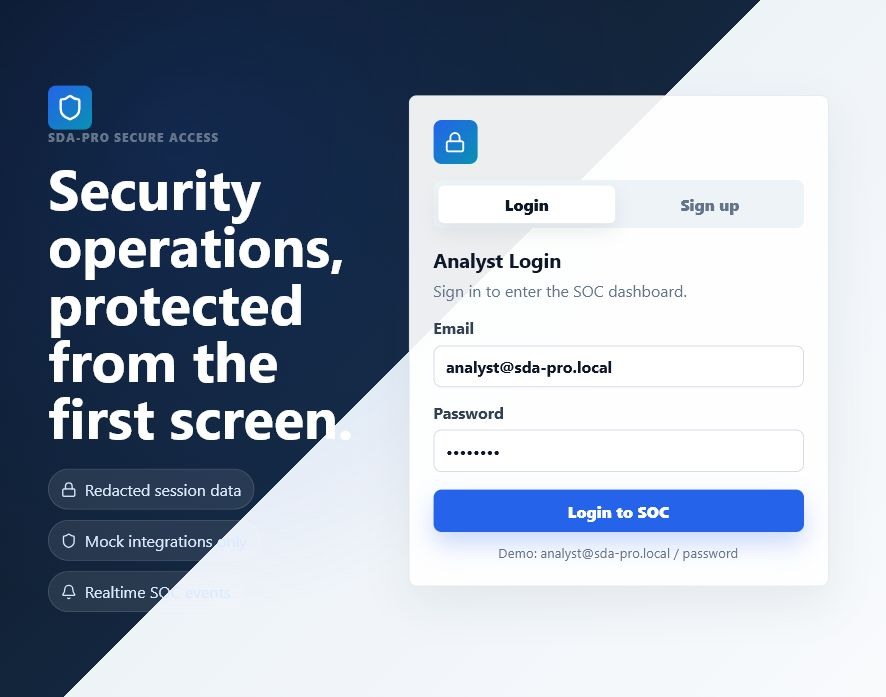

**Login requirement explanation:** Satisfies the required Login screen and identity-service boundary. It provides a separate authentication entry point before analysts can access SOC panels and avoids exposing backend tokens or integration keys in the browser.

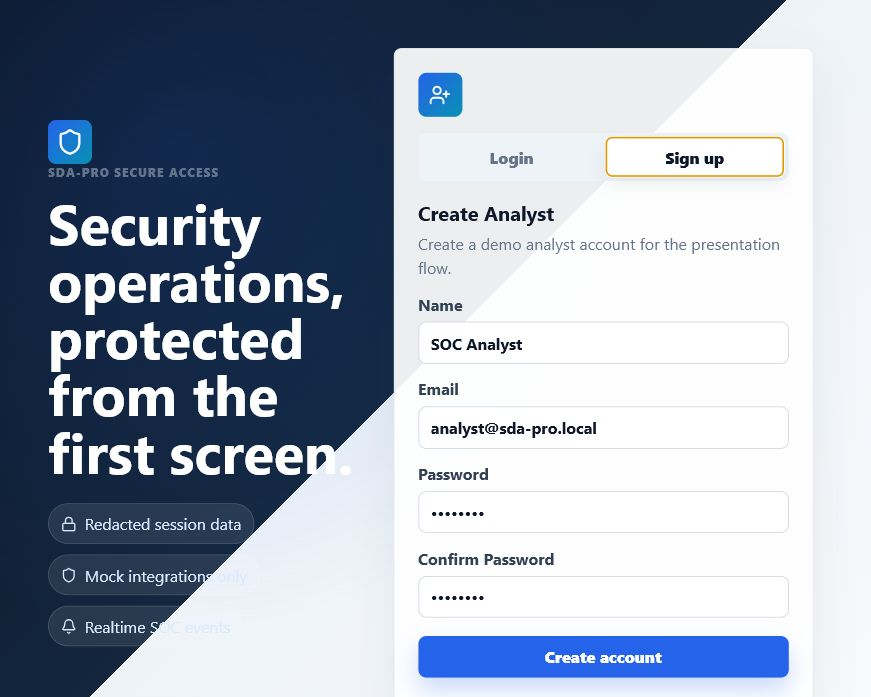

**Signup requirement explanation:** Adds analyst onboarding support for the identity requirement. The signup view creates a mock analyst profile for demonstration and keeps authentication separate from operational screens.

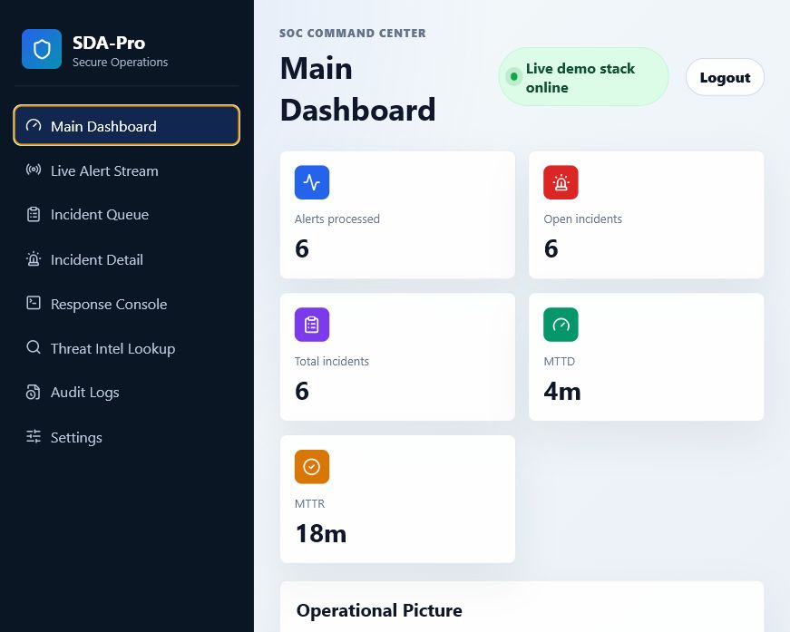

**Main Dashboard requirement explanation:** Summarizes active incidents, alert volume, response outcomes, and SOC status from the dashboard metrics API so seeded demo data is visible immediately.

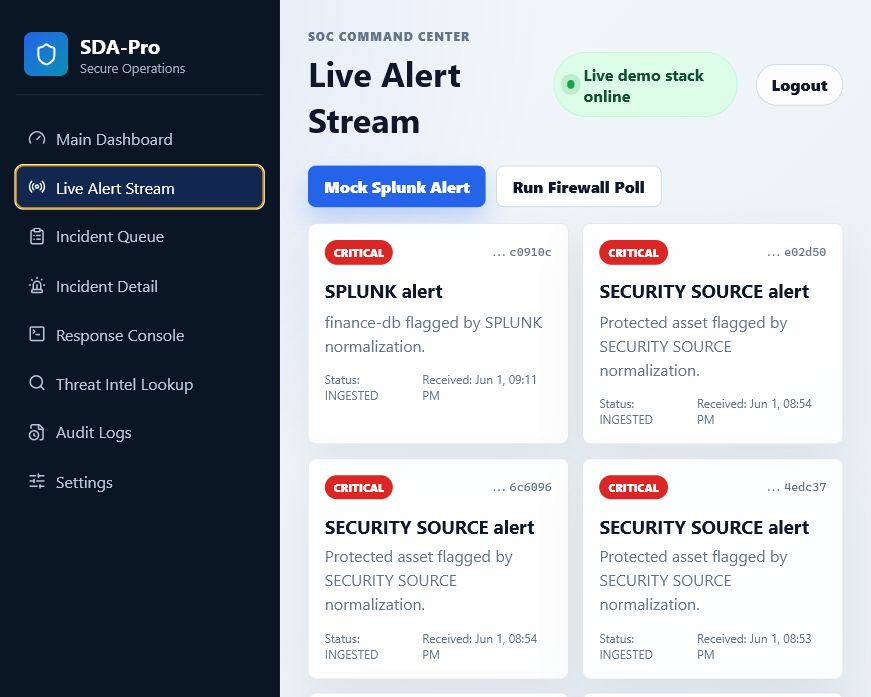

**Live Alert Stream requirement explanation:** Demonstrates event-driven behavior and realtime push from backend events/SSE after mock Splunk or Firewall alerts enter ingestion.

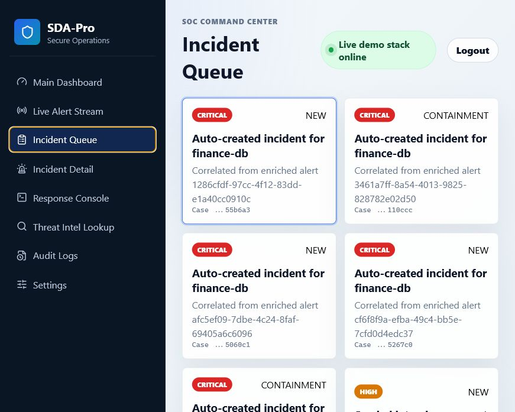

**Incident Queue requirement explanation:** Shows correlated incidents created from enriched alerts, supporting alert grouping and incident creation.

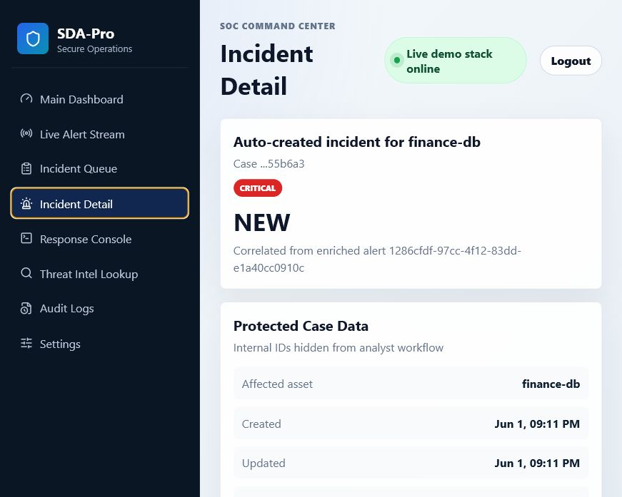

**Incident Detail requirement explanation:** Presents incident severity, linked evidence, lifecycle state, and state transition controls, proving State pattern and incident-management behavior.

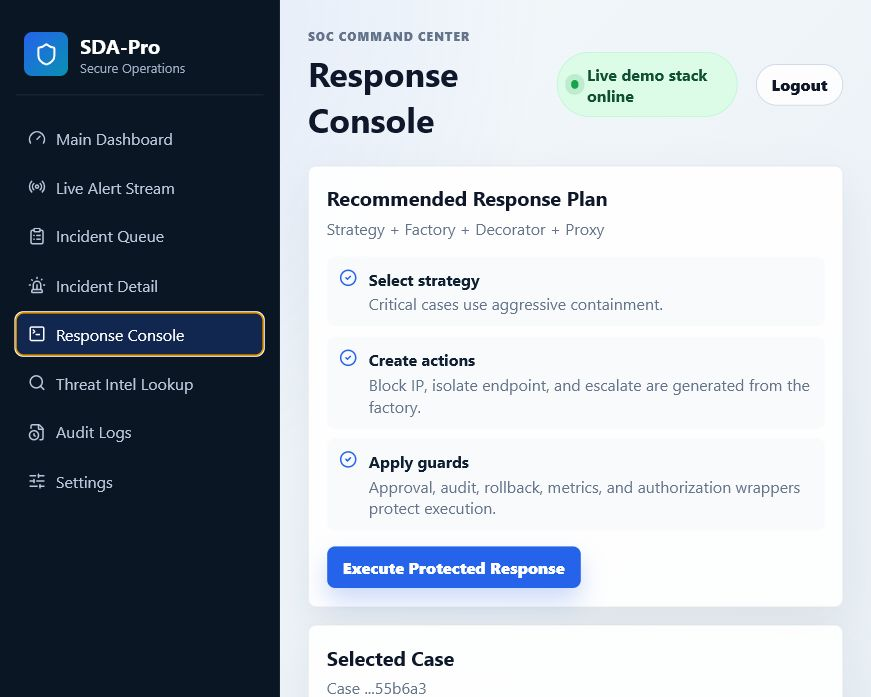

**Response Console requirement explanation:** Demonstrates response orchestration through strategy selection, factory-created actions, decorator-added audit behavior, proxy control checks, and action outcome recording.

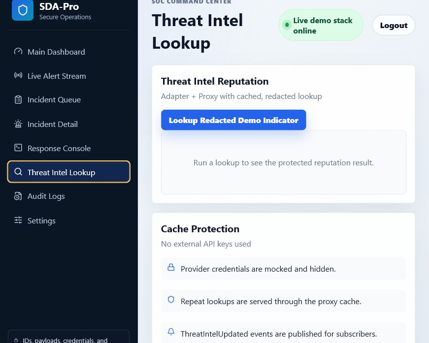

**Threat Intel Lookup requirement explanation:** Shows mock VirusTotal/MISP style reputation lookup through adapters and proxy cache, using Redis for repeat lookup simulation without real API keys.

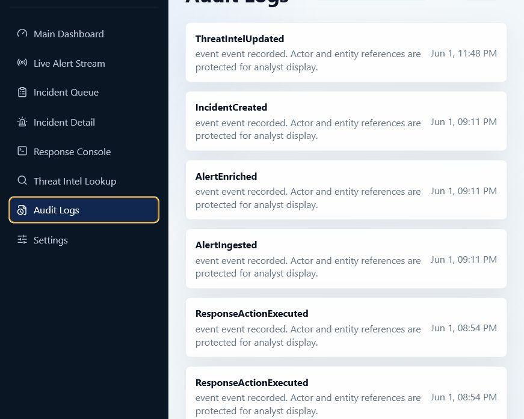

**Audit Logs requirement explanation:** Proves that significant system actions generate durable audit events such as alert ingestion, incident changes, response execution, notifications, and threat intel lookups.

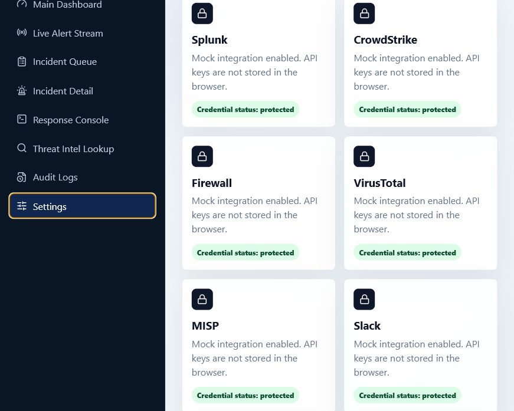

**Settings requirement explanation:** Shows mock integrations while keeping credentials protected. Raw API keys, payload identifiers, and tokens are not displayed in analyst panels.

## Design Pattern Mapping

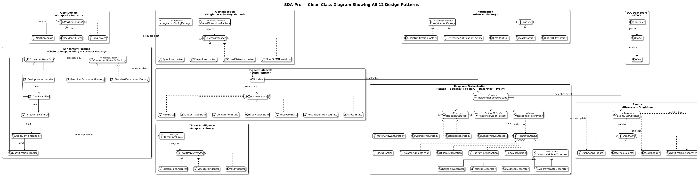

**Class diagram explanation:** This diagram is the main design-pattern proof. It links all 12 required patterns to concrete classes and collaborations: factories, adapters, proxies, decorators, State, Chain of Responsibility, Composite, Strategy, Facade, Observer, and Singleton.

| Pattern | Evidence |
|---|---|
| Singleton | `IngestionConfigManager`, `EventBusPublisher` |
| Factory Method | `AlertNormalizerFactory`, `ResponseActionFactory` |
| Abstract Factory | `EnrichmentProviderFactory`, `NotificationFactory` |
| Composite | `AlertComponent` |
| Facade | `IncidentResponseFacade` |
| Adapter | `ThreatAdapters` |
| Decorator | `Decorators` |
| Proxy | `ThreatIntelProxy`, `ResponseActionProxy` |
| State | `IncidentState` |
| Chain of Responsibility | `EnrichmentHandler` |
| Observer | `EventBusPublisher` |
| Strategy | `ResponseStrategy` |

Pattern annotation proof:

```text
C:\Users\HP\Desktop\SDA Project\services\alert-ingestion-service\src\main\java\edu\sdapro\domain\alert\AlertComponent.java:7: // PATTERN: Composite
C:\Users\HP\Desktop\SDA Project\services\alert-ingestion-service\src\main\java\edu\sdapro\domain\incident\IncidentState.java:5: // PATTERN: State
C:\Users\HP\Desktop\SDA Project\services\alert-ingestion-service\src\main\java\edu\sdapro\enrichment\EnrichmentHandler.java:7: // PATTERN: Chain of Responsibility
C:\Users\HP\Desktop\SDA Project\services\alert-ingestion-service\src\main\java\edu\sdapro\enrichment\EnrichmentProviderFactory.java:3: // PATTERN: Abstract Factory
C:\Users\HP\Desktop\SDA Project\services\alert-ingestion-service\src\main\java\edu\sdapro\events\EventBusPublisher.java:13: // PATTERN: Observer
C:\Users\HP\Desktop\SDA Project\services\alert-ingestion-service\src\main\java\edu\sdapro\events\EventBusPublisher.java:15: // PATTERN: Singleton
C:\Users\HP\Desktop\SDA Project\services\alert-ingestion-service\src\main\java\edu\sdapro\ingestion\AlertNormalizerFactory.java:5: // PATTERN: Factory Method
C:\Users\HP\Desktop\SDA Project\services\alert-ingestion-service\src\main\java\edu\sdapro\ingestion\IngestionConfigManager.java:5: // PATTERN: Singleton
C:\Users\HP\Desktop\SDA Project\services\alert-ingestion-service\src\main\java\edu\sdapro\notification\NotificationFactory.java:3: // PATTERN: Abstract Factory
C:\Users\HP\Desktop\SDA Project\services\alert-ingestion-service\src\main\java\edu\sdapro\response\Decorators.java:3: // PATTERN: Decorator
C:\Users\HP\Desktop\SDA Project\services\alert-ingestion-service\src\main\java\edu\sdapro\response\IncidentResponseFacade.java:11: // PATTERN: Facade
C:\Users\HP\Desktop\SDA Project\services\alert-ingestion-service\src\main\java\edu\sdapro\response\ResponseActionFactory.java:3: // PATTERN: Factory Method
C:\Users\HP\Desktop\SDA Project\services\alert-ingestion-service\src\main\java\edu\sdapro\response\ResponseActionProxy.java:3: // PATTERN: Proxy
C:\Users\HP\Desktop\SDA Project\services\alert-ingestion-service\src\main\java\edu\sdapro\response\ResponseStrategy.java:6: // PATTERN: Strategy
C:\Users\HP\Desktop\SDA Project\services\alert-ingestion-service\src\main\java\edu\sdapro\threat\ThreatAdapters.java:3: // PATTERN: Adapter
C:\Users\HP\Desktop\SDA Project\services\alert-ingestion-service\src\main\java\edu\sdapro\threat\ThreatIntelProxy.java:6: // PATTERN: Proxy
```

## Architecture Style Mapping

| Style | Evidence |
|---|---|
| SOA | Named service boundaries, component diagram, contracts. |
| MVC | Spring controllers/services/repositories plus React views. |
| Layered | API, application, domain, adapter, persistence, infrastructure layers. |
| Event-Driven | RabbitMQ/EventBus and AsyncAPI event definitions. |

## Sequence Diagrams

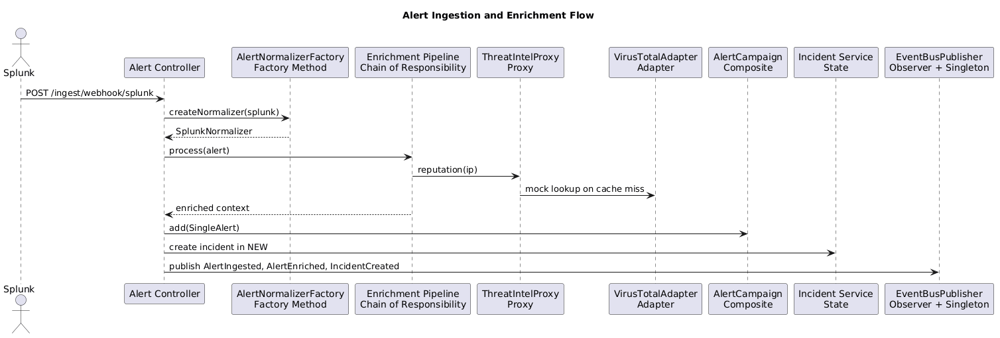

**Alert ingestion sequence explanation:** This sequence maps directly to the required demo flow: mock alert webhook, normalizer factory, enrichment chain, threat intel adapter/proxy, composite grouping, incident creation, event publishing, dashboard update, and audit storage.

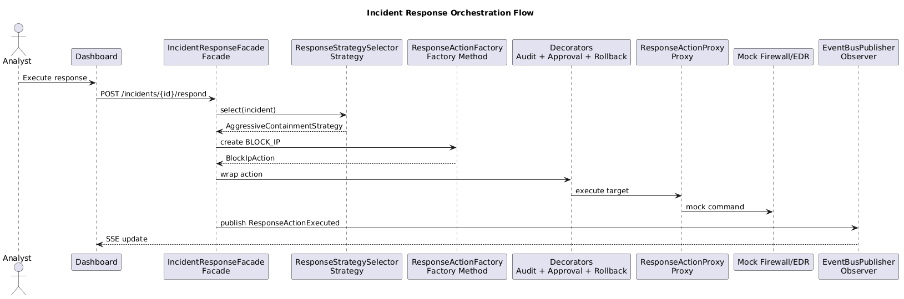

**Incident response sequence explanation:** This sequence proves state transition and response requirements: analyst changes incident state, State validates lifecycle behavior, Strategy selects response, Factory creates actions, Decorator and Proxy wrap execution, events publish, and audit logs are stored.

## Docker Runtime Proof

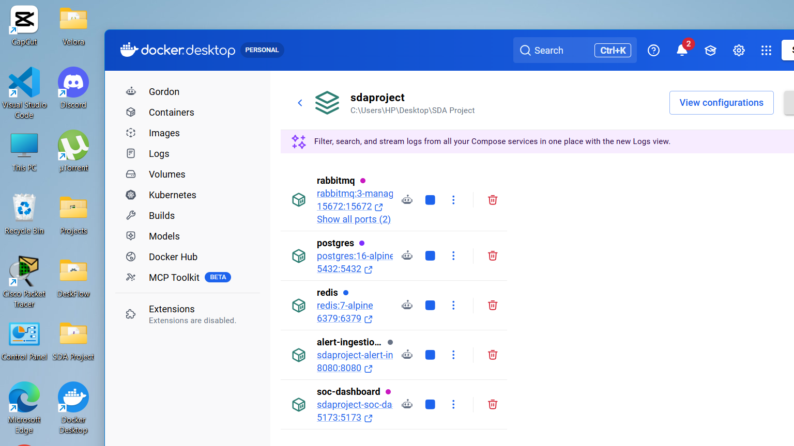

**Docker screenshot explanation:** This satisfies runtime proof for `docker-compose up --build`. It shows the local Compose project and running containers needed for the demo: RabbitMQ, PostgreSQL, Redis, Spring Boot backend, and SOC dashboard frontend.

Command-line proof:

```text
NAME                                   IMAGE                                COMMAND                  SERVICE                   CREATED          STATUS                    PORTS
sdaproject-alert-ingestion-service-1   sdaproject-alert-ingestion-service   "java -jar app.jar"      alert-ingestion-service   53 minutes ago   Up 53 minutes             0.0.0.0:8080->8080/tcp, [::]:8080->8080/tcp
sdaproject-postgres-1                  postgres:16-alpine                   "docker-entrypoint.s…"   postgres                  4 hours ago      Up 54 minutes (healthy)   0.0.0.0:5432->5432/tcp, [::]:5432->5432/tcp
sdaproject-rabbitmq-1                  rabbitmq:3-management-alpine         "docker-entrypoint.s…"   rabbitmq                  4 hours ago      Up 54 minutes             0.0.0.0:5672->5672/tcp, [::]:5672->5672/tcp, 0.0.0.0:15672->15672/tcp, [::]:15672->15672/tcp
sdaproject-redis-1                     redis:7-alpine                       "docker-entrypoint.s…"   redis                     4 hours ago      Up 54 minutes             0.0.0.0:6379->6379/tcp, [::]:6379->6379/tcp
sdaproject-soc-dashboard-1             sdaproject-soc-dashboard             "docker-entrypoint.s…"   soc-dashboard             53 minutes ago   Up 53 minutes             0.0.0.0:5173->5173/tcp, [::]:5173->5173/tcp
```

## API Proof

Dashboard metrics:

```json
{
    "alerts":  6,
    "openIncidents":  6,
    "mttr":  "18m",
    "incidents":  6,
    "mttd":  "4m"
}
```

Threat intel lookup:

```json
{
    "indicator":  "203.0.113.10",
    "score":  92,
    "verdict":  "MALICIOUS",
    "provider":  "VirusTotalMock"
}
```

## Testing Evidence

```text
-------------------------------------------------------------------------------
Test set: edu.sdapro.AuditEventCreationTest
-------------------------------------------------------------------------------
Tests run: 1, Failures: 0, Errors: 0, Skipped: 0, Time elapsed: 7.993 s -- in edu.sdapro.AuditEventCreationTest
-------------------------------------------------------------------------------
Test set: edu.sdapro.EndToEndDemoTest
-------------------------------------------------------------------------------
Tests run: 1, Failures: 0, Errors: 0, Skipped: 0, Time elapsed: 33.61 s -- in edu.sdapro.EndToEndDemoTest
-------------------------------------------------------------------------------
Test set: edu.sdapro.PatternTests
-------------------------------------------------------------------------------
Tests run: 5, Failures: 0, Errors: 0, Skipped: 0, Time elapsed: 0.224 s -- in edu.sdapro.PatternTests
```

## Required Documentation

- `README.md`
- `docker-compose.yml`
- `docs/adr/ADR-001-soa-vs-microservices-vs-modular-monolith.md`
- `docs/adr/ADR-002-sync-vs-async-communication.md`
- `docs/adr/ADR-003-database-strategy.md`
- `docs/adr/ADR-004-threat-intel-cache-strategy.md`
- `docs/adr/ADR-005-real-time-push-strategy.md`
- `docs/plantuml codes/*.puml`
- `docs/uml diagrams/*.png`
- `docs/api/openapi-sdapro.yaml`
- `docs/api/asyncapi-events.yaml`

## Limitations

- External integrations are mock integrations only.
- The system is built for SDA demonstration, not production-grade cybersecurity.
- Service boundaries are demonstrated through code modules, contracts, diagrams, and docs; the local demo runs through a Spring Boot composition root.

## Conclusion

The project satisfies the SDA-Pro requirements with complete runnable project files, seeded demo data, modern frontend screens, required backend features, design pattern annotations, architecture style evidence, diagrams, ADRs, and tests.
